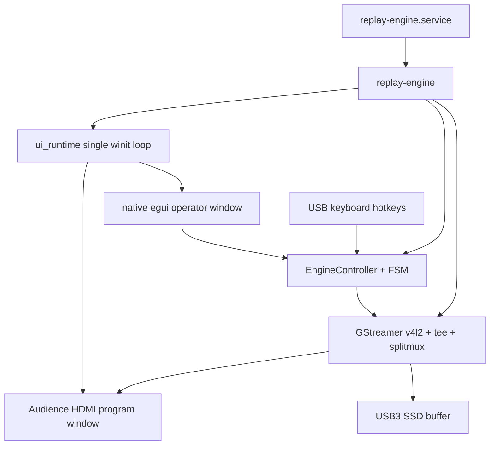

# Architecture — Pi 5 appliance

## Runtime

One process (`replay-engine`). No gRPC, no Flutter, no browser.

## Control plane

| Client | Path |
|--------|------|
| Native operator UI | egui on Pi touch → `ControlApi` |
| Keyboard | `global-hotkey` → `ControlApi` |
| GPIO (v1.1) | `gpio.rs` stub → `ControlApi` |

`ControlApi` wraps `EngineController` (mark, replay, status, diagnostics).

## GStreamer

- **Live + buffer:** `v4l2src` (or `videotestsrc` with `--test`) → `tee` → program sink + `splitmuxsink` MPEG-TS chunks (~1 s)
- **Replay:** separate pipeline; `playbin` at 0.5× (concat for multi-segment)
- **Threading:** GStreamer on dedicated runtime thread; UI on dedicated winit thread

## State machine (`replay-core`)

`Starting` → `Live` → `Marked` → `Replaying` → `ReturningToLive` → `Live`

Signal loss → `NoSignal`.

## Buffer

`index.json` + TS chunks under `/var/lib/instant-replay/buffer`. Mark uses monotonic timestamp (~1 s chunk granularity).

## Config

`/etc/instant-replay/config.toml` — see [CONFIG.md](CONFIG.md).
